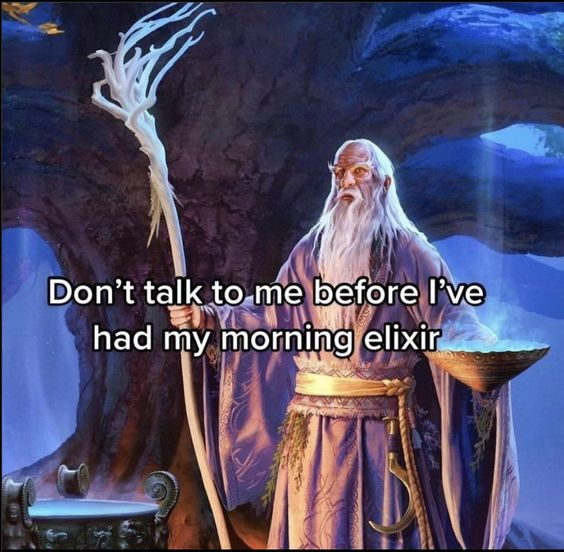
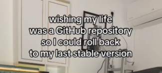

<!--
### Hi there 👋
-->

  
   
   
   
  
   
   
   
  <!--
  <i>🔭 Currently working on a private nuxt app (&& my CS degree... && actual work stuff)</i>
  -->

<!--
**marekprochazka/marekprochazka** is a ✨ _special_ ✨ repository because its `README.md` (this file) appears on your GitHub profile.

Here are some ideas to get you started:

- 🌱 I’m currently learning ...
- 👯 I’m looking to collaborate on ...
- 🤔 I’m looking for help with ...
- 💬 Ask me about ...
- 📫 How to reach me: ...
- 😄 Pronouns: ...
- ⚡ Fun fact: ...
-->
